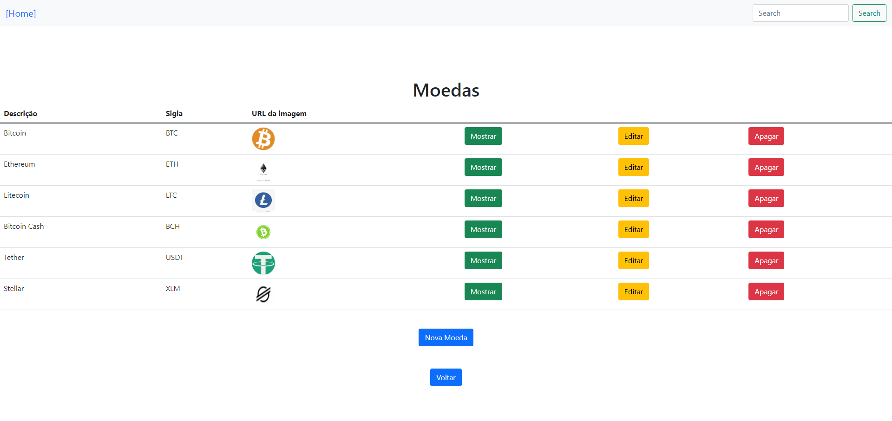

# Crypto Wallet



> Aplicação desenvolvida durante o curso de Ruby On Rails 5.x - do Início ao fim do Jackson Pires, uma carteira que permite armazenar as informações de cripto moedas

## 💻 Pré-requisitos

* Você instalou a versão  ` Ruby '2.5.8' | Rails '5.2.0'`. 
* Você tem uma máquina `< Linux / Mac>`.

## 🚀 Instalando <crypto_wallet>

Clone este repositório:
```
git clone https://github.com/vits56/crypto-wallet
```

Instale as Gems:
```
bundle
```

Instale  as dependências:
```
yarn install
```

Migre o Banco de Dados:
```
rails db:migrate
```
Caso queira popular as tabelas para ter dados pré configuados rode a task dev:setup:
```
rails dev:setup
```

> ### Caso queira ver a aplicação no ar:
> [Crypto Wallet](https://safe-citadel-94270.herokuapp.com/)


## License

This project is under license from MIT. For more details, see the [LICENSE](LICENSE) file.

Made with 💜 by <a href="https://github.com/vits56" target="_blank">Bruno Bastos Duarte</a>

&#xa0;

<a href="#top">Back to top</a>